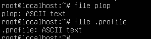

MEULENYZER\
Alexandre\
ICS3

{width="6.3in"
height="2.270138888888889in"}

Q.1

Which localise une commande, un binaire

{width="6.3in"
height="0.5145833333333333in"}

Q.2

Une fois dans le Manuel de which, faire /options

{width="6.136272965879265in"
height="0.718850612423447in"}

Q.3

Presser Q

{width="0.9376312335958005in"
height="0.33338035870516186in"}

Q.4

La section 6 parle des jeux et programme disponible sur le système

{width="6.195651793525809in"
height="2.3240518372703414in"}{width="5.031952099737532in"
height="1.7294083552055992in"}

Q.1

{width="2.87540135608049in"
height="0.39588910761154855in"}

Q.2

{width="3.0004188538932635in"
height="0.3854702537182852in"}

Q.3

{width="3.6880150918635173in"
height="0.4271434820647419in"}

Q.4

{width="2.5732753718285215in"
height="0.6563418635170604in"}

Q.5

{width="3.406725721784777in"
height="0.34379811898512685in"}

Notre utilisateur n'a pas les permissions nécessaires.

Q.6

{width="6.3in"
height="0.8368055555555556in"}

Nous ne pouvons pas utiliser sudo avec une commande intégrée au shell

Q.7

{width="5.761220472440945in"
height="0.729268372703412in"}

Q.8

{width="3.875541338582677in"
height="0.5834142607174103in"}

Avec RM nous pouvons supprimer des fichiers mais pas des dossiers

Q.9

Rmdir permet de supprimer un dossier vide

Q.10

La commande ne supprimera pas le dossier car il n'est pas vide.

Q.11

Avec rm --rd, nous supprimons le dossier, et avec la récursivité (-r)
tout ce qu'il contenait sera supprimé.

{width="5.688293963254593in"
height="7.448956692913386in"}

Q.1

La commande date permet d'affiché la date et l'heure

La commande time permet de chronométré une tache\
\
Q.2

Les fichiers commençant par un point sont des fichiers cachés

Q.3

Commande : whereis ls

{width="3.7401049868766405in"
height="0.2396172353455818in"}

Q.4

Non car quand nous faisons man ll, il est spécifié qu'il n'existe pas
d'entré manuel pour ll

Q.5

Ls --L /bin

Q.6

Ls affiche tout le contenu du dossier dans lequel on se trouve

Q.7

Pwd

Q.8

La commande crée un fichier nommé plop avec écrit le texte « bip »
dedans

Q.9

La commande crée un fichier nommé plop avec écrit le texte « bip » deux
fois dedans

Q.10

La commande va renvoyer le mot « toto », nous devront attendre la fin du
sleep de 10 seconde pour ravoir accès au terminal

Q.11

La commande file va déterminer et nous donné le type de fichier

{width="3.1150185914260717in"
height="0.8021948818897637in"}

Q.12

Après modification, le lien physique replique le fichier original

Après suppression d'original, le lien_phy reste intact

Q.13

La réplication se fait dans les deux sens

Lien_sym est supprimé si lien_phy est supprimé

Q14

CTRL + S interrompt le défilement

Q15

5 première ligne

{width="6.3in"
height="0.8923611111111112in"}

15 dernière ligne

{width="6.3in"
height="1.6388888888888888in"}

Q16

Le dmesg la commande permet pour revoir les messages qui sont stockés
dans la mémoire tampon en anneau.

Q17

Le fichier contient les mdp

La commande pour accéder au manuel est man passwd

{width="4.151999125109361in"
height="3.3925470253718286in"}Q18

Q19

> La commande qui nous donne le nombre d'utilisateurs ayant un compte
> sur cette machine est la suivant : **wc -l
> /etc/passwd**{width="4.021394356955381in"
> height="0.3854702537182852in"}

Q20

Man --k conversion

Q21 **find / -name « passwd »**

{width="3.888888888888889in"
height="2.5336712598425195in"}

Q22 La commande est la suivante :

find / -type f \--name passwd \> \~list_passwd_files.txt 2\> /dev/null

Q24 La commande **locate** permet d'indiquer le chemin d'un fichier avec
des caractéristiques particulières. Pour chercher l'emplacement du
fichier history.log nous allons utiliser la commande locate :

{width="4.052648731408574in"
height="0.3854702537182852in"}

Q25 Rien ne se passe car nous sommes déjà dans le bon dossier où est
situé le fichier créé.

Exercice 3. Découverte de l'éditeur de texte nano :

{width="6.3in"
height="2.4347222222222222in"}

{width="6.3in"
height="1.2208333333333334in"}

1)  Pour copier un fichier il faut utiliser la commande
    **cp** :{width="5.9070745844269466in"
    height="0.8230314960629921in"}

2)  

{width="6.3in"
height="1.8069444444444445in"}

Pour remplacer kernel par le mot noyau, nous devons faire **ctrl \\**
pour spécifier remplacer le mot kernel par noyau et de tous les
remplacer.

{width="6.3in"
height="2.1805555555555554in"}

3\) On va les couper puis les coller à la fin du fichier, pour cela on
sélectionne le texte voulu avec Alt {width="6.3in"
height="1.675in"}

Puis nous allons à la dernière ligne où nous allons coller la
sélection :

{width="6.3in"
height="1.1861111111111111in"}

4\) Pour annuler notre action précédente, nous allons utiliser le
raccourcie **Alt U**.

5\) Pour enregistrer sous nano il suffit de faire **Ctrl O** et Oui.

Exercice 4 : Personnalisation du shell :

{width="6.3in"
height="0.44375in"}

{width="6.3in"
height="0.6777777777777778in"}

1)  Ce fichier ce trouve dans /etc/skel , de plus le fichier rechercher
    est un fichier caché il faut donc utiliser ll pour le voire. Nous
    avons ensuite fait un copie du fichier pour avoir un backup.{width="5.229896106736658in"
    height="3.1462718722659666in"}

2)  {width="4.760416666666667in"
    height="0.65625in"}

{width="6.3in"
height="2.3159722222222223in"}

{width="6.3in"
height="1.2381944444444444in"}

3)  {width="3.875in"
    height="0.6979166666666666in"}

Grace à la commande source .bashrc , les modifications de couleurs du
bash ce sont bien activés.

4)  Dans le fichier config nous avons indiqué ceci :

{width="6.3in"
height="0.15555555555555556in"}

Une fois terminé, on enregistre puis on actualise le .bashrc.

{width="4.989583333333333in"
height="0.6666666666666666in"}

[.bashrc generator: create your .bashrc PS1 with a drag and drop
interface](https://bashrcgenerator.com/)
